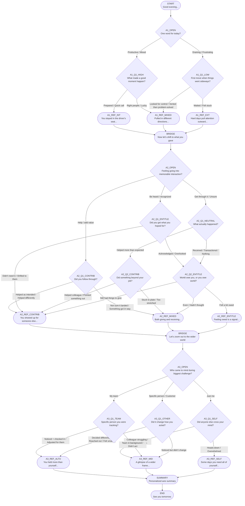

# Tree Diagram — Daily Reflection Tree

Visual representation of all branching paths. Rendered as Mermaid.

## Axis Color Key
- 🔵 **Axis 1 (Locus):** A1_* nodes — Internal vs External
- 🟡 **Axis 2 (Orientation):** A2_* nodes — Contribution vs Entitlement  
- 🟣 **Axis 3 (Radius):** A3_* nodes — Altrocentric vs Self

## Possible Paths
The tree has **18 distinct terminal states** (3 axis outcomes × 3 axis outcomes × 2 axis outcomes = 18 summary combinations), accessible through dozens of unique traversal paths.
